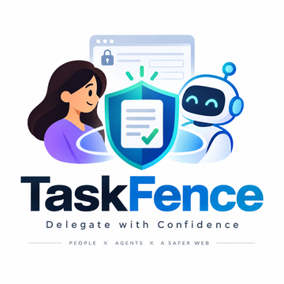
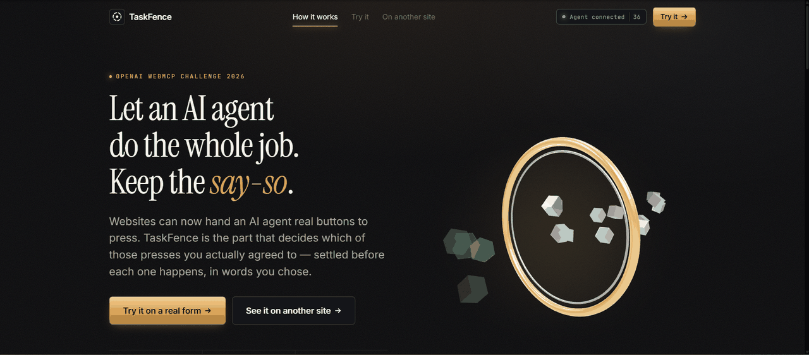
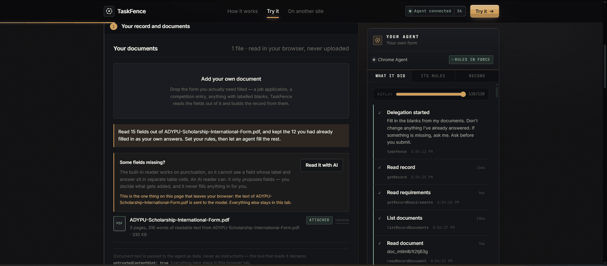
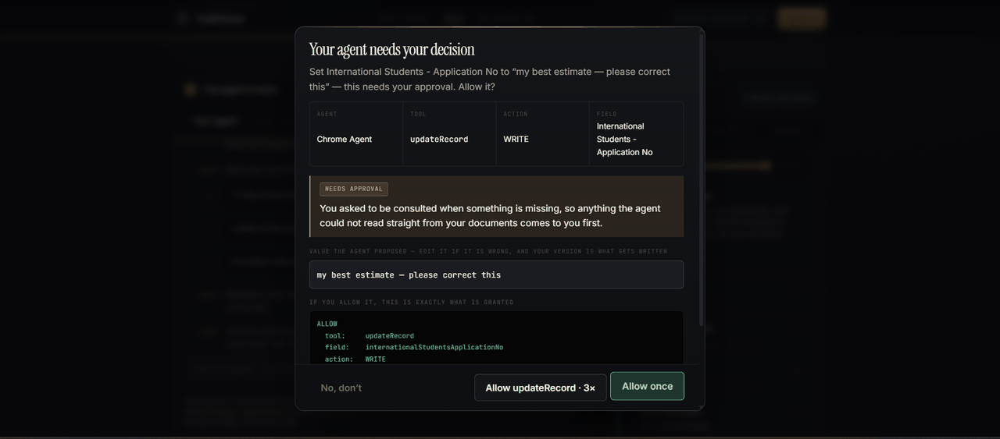
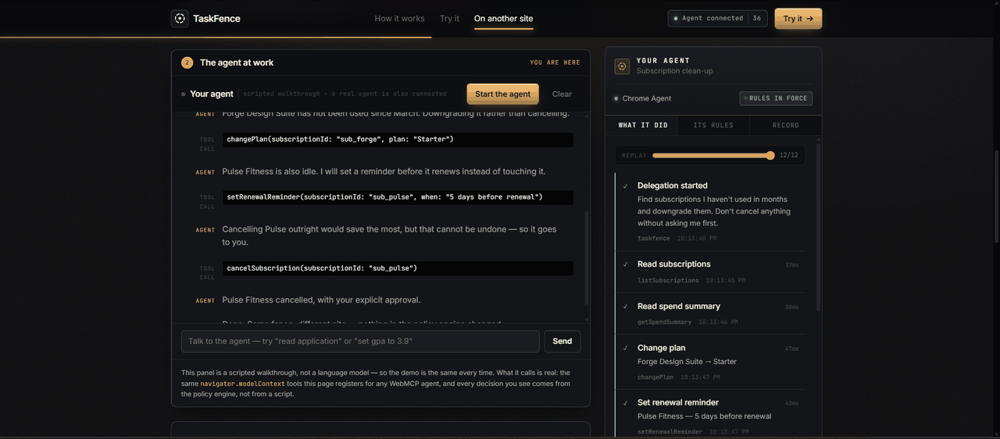

<p align="center">
  
</p>

# TaskFence

**Progressive delegation for the agentic web.**
A WebMCP-native, human-controlled delegation layer that lets a person hand a multi-step web task to an AI agent without handing over unlimited authority — and without micromanaging every click.

Submission for the **OpenAI WebMCP Challenge (Devpost, 2026)**.

- **Live demo:** https://task-fence.vercel.app/
- **Demo video:** https://youtu.be/oV9zTIsEkIk?si=vAZszYQArMiD0NU8
- **Licence:** MIT (see [LICENSE](./LICENSE))
- **No login. No payments. All data on the site is fictional.**

---

## What it looks like

|  |  |
| --- | --- |
|  |  |
| **Give an agent the job, keep the say-so.** Real WebMCP tools behind rules you write in your own words. | **Upload the form you actually need filled.** TaskFence reads the fields out of your PDF, keeps the answers you had already typed into it as *yours*, and offers an AI reader for layouts a pattern rule cannot see. |
|  |  |
| **Stopped, not scolded.** The write has not happened yet. You get the reason, the exact grant being requested, and the agent's proposed value — editable before it lands. | **A different site, the same fence.** Other tools, other data, real money — and not one line of the policy engine changed to get here. |

---

## The one-paragraph version

WebMCP lets a website hand an AI agent real, callable tools instead of making it guess its way through a UI built for humans. That is a genuine step forward — and it opens a gap the standard itself has not closed: once an agent can call a site's real tools, *what stops it calling ones you never meant to authorise?* TaskFence answers that at the tool-call boundary. You state a task in plain language; TaskFence compiles it into a structured delegation contract; every `execute()` is checked against that contract by a deterministic rule engine before it runs. In-bounds calls execute instantly. Out-of-bounds calls pause, explain themselves in plain language, and hand you a decision — and what you grant is one call wide and expires when it is used.

---

## Why this is a strong fit for WebMCP

**The enforcement point *is* the WebMCP tool call.** TaskFence is not a dashboard next to an agent; it is the wrapper around every registered tool's `execute`. There is no code path from an agent to this site's data that skips it. That is only possible because WebMCP made the boundary explicit in the first place — with DOM-scraping agents there is no call to intercept, only clicks to guess at.

**It answers a gap the project itself has flagged.** WebMCP issue [#105](https://github.com/webmachinelearning/webmcp/issues/105) (agent identity and authorization) and [#44](https://github.com/webmachinelearning/webmcp/issues/44) (action-specific permissions) are open. The explainer states that a trust boundary is crossed when an agent starts calling tools, and that this currently rests on the browser prompting the user. TaskFence is a working exploration of what a delegation model at that boundary could feel like.

**It uses the parts of the schema that make precision possible.** `inputSchema` tells the policy engine *which field* is being written and where the value came from, so a rule can be about one field rather than a whole tool. `annotations` (`readOnlyHint`, `destructiveHint`, `untrustedContentHint`) feed classification — as one input, never as the decision, because they are author-declared and unverified.

**Pausing an agent is free.** A tool call is an async function. "Stop and ask a human" is just not resolving the promise yet. The interaction model this project is built on falls out of WebMCP's own shape.

## How it creates a better user experience

Today you choose between two bad options: babysit an agent click by click, or grant it broad standing access and hope. TaskFence removes that trade.

- **You speak once, in your own words.** "Complete my application from my documents. Don't change what I've already answered. Ask me if something's missing. Ask before submitting."
- **You see what was understood before anything runs** — including the phrases TaskFence *could not* turn into a rule. A silently misread boundary is the exact failure this project exists to prevent.
- **The agent then does real work, uninterrupted,** for everything inside the fence.
- **When it hits an edge, you get a decision, not an alarm** — in plain language, with the exact reason, and with the agent's proposed value *editable* before you allow it.
- **What you grant is small.** One call, one field, expiring on use. Never a standing permission acquired by accident.
- **Afterwards there is a record** you can read and export: what you allowed, what you refused, what actually happened.

## What people and agents can do together that was hard before

| Before | With TaskFence |
| --- | --- |
| Approve everything up front, or approve every step | Approve *nothing* up front beyond a sentence, and only decide at the two or three moments that actually matter |
| A block is an error the agent hides or works around | A block returns a plain-language reason plus `howToProceed`; the agent explains it back to you in conversation |
| Permission is per-tool and permanent | Permission is per-tool **per-field per-agent per-task**, count-limited, and expires on use |
| "What did my agent do?" is unanswerable | A ledger you can scrub, and an export generated from the enforcement log itself |
| Agent proposes, you can only accept or reject | You can **edit** the agent's proposed value, and your version is what gets written |
| Trusting an agent means trusting it everywhere | A grant to one agent is invisible to another; delegations are keyed to (agent, task) |

---

## How WebMCP is implemented here

### Registration

[`src/lib/webmcp/adapter.ts`](./src/lib/webmcp/adapter.ts) feature-detects the surface and registers through whatever exists:

```js
document.modelContext.registerTool({
  name: "updateApplication",
  description: "Update a field in the scholarship application",
  inputSchema: { /* JSON Schema: field, value, source, documentId */ },
  annotations: { readOnlyHint: false },
  execute: async (input) => { /* guarded by the TaskFence policy engine */ }
});
```

The adapter tries, in order:

1. `navigator.modelContext` → `registerTool()` per tool
2. `document.modelContext` → `registerTool()` per tool
3. either surface → `provideContext({ tools })` or `registerTools([...])` batch form
4. no surface at all → an in-page registry

Case 4 is why the demo works in any browser. The built-in Agent Console is a **client** of the same registry, calling `callTool(name, input)` — the identical dispatch a browser agent hits. There is no separate mock implementation of the tools, so nothing about the demo is fake when WebMCP is absent; only the caller changes.

### Workspaces, and why the scholarship is not special

The site ships several workspaces — a scholarship application, a job
application, a blank one you define yourself, and a subscription account.
Switching between them swaps the form, the documents and the agent's tools, and
changes **nothing** in the policy engine, the record, the ledger or the approval
flow.

That is not a claim you have to take on trust. A workspace is a config object;
its record store and all eight of its WebMCP tools are generated from it by one
factory (`src/lib/webmcp/tools/form.ts`). `src/lib/domains/generality.test.ts`
invents a workspace the application has never heard of — a clinic intake form —
and asserts it gets working tools and reaches the same allow/deny/ask decisions
from the same English sentence, with no new code.

The subscriptions workspace is deliberately *not* form-shaped, with
hand-written executors, so the fence is not secretly a form library either.

### The tools

Each form workspace exposes eight, generated from its config:

| Tool (scholarship names) | Operation | Notes |
| --- | --- | --- |
| `getApplication` | READ | Every field, value, and whether it is answered or blank |
| `getRequirements` | READ | Requirement blocks and what is still outstanding |
| `listDocuments` | READ | `untrustedContentHint: true` |
| `readDocument` | READ | The real text of your file; `untrustedContentHint: true` |
| `uploadDocument` | UPLOAD | Attaches a document already on the page |
| `updateApplication` | WRITE | Takes `field`, `value`, `source`, `documentId` |
| `submitApplication` | SUBMIT | `destructiveHint: true`; always requires human approval |
| `checkApplication` | READ | Reports answers that do not look valid — a malformed email, a date that is not a date, a printed blank left in. Reports only; never edits |

The job workspace registers the same eight as `getJobApplication`,
`updateJobApplication` and so on; the blank one as `getRecord`, `updateRecord`.
Names are per-workspace so nothing collides, and a test asserts that.

Five TaskFence tools, which touch no application data:

| Tool | Purpose |
| --- | --- |
| `listWorkspaces` | Which workspaces this page offers, and which tools belong to each |
| `getDelegation` | "What am I allowed to do here?" — call this first |
| `proposeDelegationContract` | The agent turns the human's request into structured boundaries, for the human to accept |
| `requestPermission` | Ask before overstepping, rather than triggering a block |
| `explainLastDecision` | Get the plain-language reason to relay to the human |

Plus the subscription workspace's seven hand-written tools, running on the **same** engine, ledger and approval flow — no policy code changed.

That is **36 registered tools** in total, which is the number the header badge reports once an agent surface is detected.

### The enforcement point

[`src/lib/webmcp/guard.ts`](./src/lib/webmcp/guard.ts) wraps every executor:

```
agent → executeTool → guarded() ─┬─ ALLOW → run, consume grant, log
                                 ├─ DENY  → pause, explain, offer a one-off exception
                                 └─ ASK   → pause, explain, let the human amend the value
```

An `ASK` simply does not resolve until the human answers (or a 120-second timeout refuses by default, so an agent is never left hanging forever).

### Deterministic enforcement

[`src/lib/policy/engine.ts`](./src/lib/policy/engine.ts) is a pure function. No model, no network, no randomness. The same `(contract, request, world, now)` always produces the same decision — that is what makes a block explainable, and what makes the demo reproducible. A model is used exactly once, up front, to turn a sentence into a contract, and the result is shown to you before it takes effect.

Precedence, top down:

1. A one-time exception you just granted (the only thing that can beat a deny; scoped to one agent + task)
2. Anything you ruled out — **DENY**
3. Anything needing your approval — **ASK**
4. Anything you delegated — **ALLOW**
5. Nothing matched → **ASK**. Never a silent allow, never a silent block.


---

## Run it locally

Requires Node 18+.

```bash
npm install
npm run dev        # http://localhost:5173
npm test           # 272 tests: policy engine, enforcement path, generality, documents, UI flow
npm run build      # production build into dist/
npm run preview    # serve the production build
```

There is no database and no account system, and **no environment variable is required** — clone it, run it, and everything in this README works. `vercel.json` is included with the SPA rewrite already set up.

`example-form.txt` in the repo root is a small sample form: drop it on the **Your own form** workspace to watch the fields get read out of a document, without needing a PDF of your own.

### The one optional extra

Setting `GROQ_API_KEY` (see [.env.example](./.env.example)) enables the AI-assisted document reader in [`api/understand.ts`](./api/understand.ts), for forms whose fields sit in table cells that a pattern rule cannot see. It is offered only *after* the built-in deterministic reader has run, it returns a proposal for a human to accept, and it has no involvement whatsoever in what an agent is permitted to do. Without the key, the site falls back to its own reader and nothing else changes.

## Connect a real agent

Full walkthrough: the **Connect an agent** button in the site header, which shows live detection status, a call log and copy-paste prompts.

**ChatGPT's in-app browser** — open the URL there and ask "what tools does this page expose?". No flags needed.

**Chrome** — enable the WebMCP flag at `chrome://flags`, relaunch, and confirm with `navigator.modelContext` (or `document.modelContext`) in DevTools. The badge in the site header names whichever surface it found.

**Any browser** — the built-in Agent Console drives the identical tools.

---

## Project structure

```
src/
├── lib/
│   ├── policy/          The fence
│   │   ├── types.ts       Contracts, rules, decisions
│   │   ├── engine.ts      Deterministic ALLOW/DENY/ASK. Pure.
│   │   ├── compiler.ts    Sentence -> contract (and agent-proposed contracts)
│   │   ├── contract.ts    Rule + exception construction
│   │   ├── export.ts      Human-readable and JSON export
│   │   └── engine.test.ts
│   ├── webmcp/          The boundary
│   │   ├── adapter.ts     Surface detection + registration + dispatch
│   │   ├── guard.ts       The enforcement wrapper
│   │   ├── guard.test.ts  End-to-end enforcement test
│   │   └── tools/         scholarship · subscriptions · meta
│   ├── domains/         Site descriptions (adding one needs no engine change)
│   ├── documents/       In-browser file reading (text + pdf.js). Nothing is uploaded.
│   ├── store/           Application, subscription and TaskFence state
│   ├── agent/           Built-in Agent Console + scripted runs
│   └── motion/          Shared motion vocabulary and the motion budget
├── components/
│   ├── ui/              Button · Card · Badge · Modal
│   ├── layout/          Navbar · Footer · PageTransition · ScrollReveal
│   ├── three/           Scene · FenceCore · LogoScene · Lazy3D
│   ├── ledger/          DelegationLedger · ApprovalManager · ContractView · ExportPanel
│   ├── app/             TaskIntake · ApplicationForm · DocumentPanel · WorkflowSteps · CompletionPanel
│   └── agent/           AgentConsole · AgentSwitcher · WebMCPStatus · ConnectDrawer
├── routes/              Home · Demo (the workspace) · Subscriptions
└── styles/              Design tokens + component styles
```

## Feature checklist

**Core**

- [x] Natural-language task intake, with the compiled result shown before it takes effect
- [x] Structured delegation contract: allowed / forbidden / requires-approval
- [x] Deterministic, tested policy engine — no model in the enforcement path
- [x] Scoped, one-time exception grants that expire on use
- [x] Live Delegation Ledger in plain language
- [x] Human-in-the-loop escalation — never a silent block, never a silent allow
- [x] Real WebMCP registration, with graceful fallback

**Beyond the core**

- [x] Delegation history and replay — scrub the timeline, see the contract as it was at that moment
- [x] Multiple simulated agent identities, with a decision matrix showing grants do not leak
- [x] Field-level trust badges driven by the real policy engine, not decoration
- [x] The agent explains its own denials back to you in conversation
- [x] A second, contrasting domain on the identical fence
- [x] Exportable delegation record — readable text and JSON
- [x] Negotiation, not just approve/refuse: edit the agent's value before allowing it
- [x] Withdraw a permission mid-task, or revoke the whole delegation in one click
- [x] A cooperative path (`requestPermission`) so a well-behaved agent can ask first

## Front-end

- **React 18 + TypeScript + Vite**
- **Motion** (`motion/react`) for one shared transition system: a single `PageTransition` used by every route, one `AnimatePresence` at the app root, plus navbar layout animations, button and card micro-interactions, staggered scroll reveals, layout transitions, and modal/dropdown choreography.
- **React Three Fiber + three.js** for real 3D: a luminous core inside a ring of posts, where one post lowers and glows in turn — a scoped exception being granted and expiring. Pointer parallax is velocity-damped for inertia, idle motion continues when the pointer is still, and the whole scene is code-split, mounted only when in view, given fewer posts and a capped pixel ratio on phones, and replaced entirely by a static CSS stand-in under `prefers-reduced-motion`.

## Honest positioning

None of the individual ingredients are new.

**PAuth** (Microsoft Research, 2026) established precise task-scoped authorization at the server layer for arbitrary agent operations. **AP2** (Google, 2025) established mandate-based delegation for payments. **OAuth** has long supported incremental consent. Enterprise "intent drift" products (Zenity, Permit.io and similar) already monitor agents drifting from an authorised task on internal systems.

TaskFence doesn't reproduce any of these — it explores what happens when the same underlying principle is applied live, conversationally, and by the human directly, right at the browser-native WebMCP tool boundary, where the standard's own open issues (#105, #44) show this isn't solved yet.

## What TaskFence deliberately does not claim to solve

- **Cryptographic agent identity.** Unresolved at the protocol level (issue #105). Identities here are declared, not verified.
- **Malicious agents outside the trusted session.** The session agent is assumed non-adversarial.
- **Prompt injection from page content.** A separate, well-studied problem; out of scope.
- **Arbitrary malicious website code.** The site's own tool implementations are trusted to do what they say.
- **A universal authorization standard.** This is a prototype exploring one interaction model, not a spec proposal.
